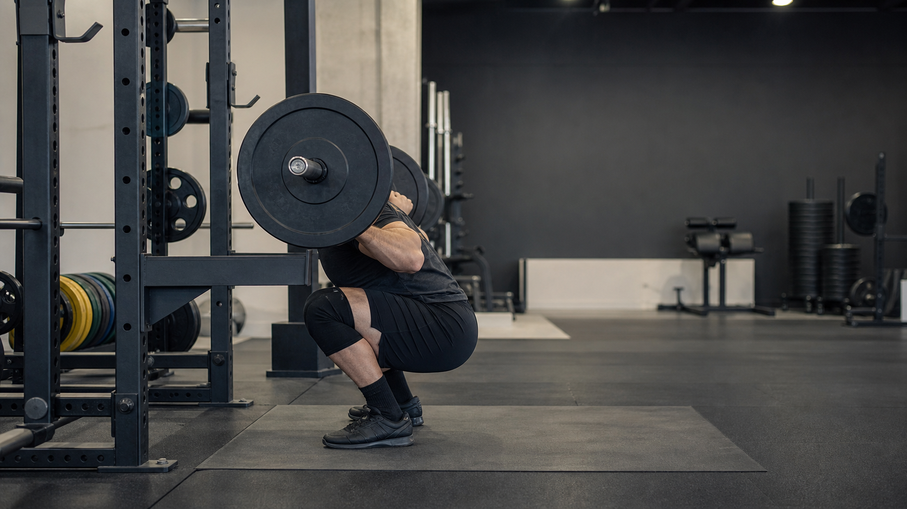

# Powerlifting Video Assisted Judge

力量举视频辅助判罚与动作分析项目。系统面向深蹲视频，使用人体姿态识别、单目深度/地面平面估计和可解释规则引擎，输出“可能合格 / 可能不合格 / 无法判断”的辅助结论，并保留关键帧、规则证据和可视化产物。

本项目不是完全自动裁判。普通单机位视频无法可靠判断所有 IPF 规则，例如裁判口令、保护员是否助力、脚掌是否完全平放等，因此系统会把低可信场景标记为需要人工复核。





## 技术栈

- Python 3.12
- OpenCV
- MediaPipe Pose Landmarker
- NumPy
- Open3D 或 NumPy RANSAC
- PyTorch / Torch Hub
- MoGe-2 或 Metric3D v2
- unittest

## 核心功能

- 从视频中提取 MediaPipe 2D 人体关键点。
- 在深蹲最低点帧运行单目几何分支，估计场景点云和地面平面。
- 将髋、膝等关键点投影到地面坐标系，使用 `Zg` 高度判断深蹲深度。
- 根据完整视频关键点检测深蹲开始、最低点和结束帧。
- 评估深蹲深度、起始锁膝、完成锁膝、底部二次下沉、脚步移动等规则。
- 输出统一 JSON 报告，包含最终判定、失败原因、证据帧、置信度和产物路径。
- 对 Grounded SAM 不可用、Open3D 不可用、单目几何不稳定等情况给出明确降级或不确定结果。

## 本地运行方式

本项目使用本地虚拟环境 `.venv`。在 Windows PowerShell 中，请始终使用项目内解释器。

```powershell
.\.venv\Scripts\python.exe -c "import sys; print(sys.executable)"
.\.venv\Scripts\python.exe -m pip install -r requirements.txt
```

运行单张图片的地面坐标分析：

```powershell
.\.venv\Scripts\python.exe scripts\run_single_image.py `
  --image_path data\your_image.jpg `
  --output_dir outputs\image_test `
  --geometry_backend metric3d `
  --seg_backend lower_region `
  --metric3d_model metric3d_vit_small
```

运行通用图片或视频地面坐标 CLI：

```powershell
.\.venv\Scripts\python.exe -m ground_pose.cli `
  --path data\your_video.mp4 `
  --output_dir outputs\ground_pose_test `
  --geometry_backend metric3d `
  --seg_backend lower_region `
  --frame_stride 30 `
  --max_video_frames 1 `
  --max_ground_points 50000
```

运行统一深蹲辅助判罚流水线：

```powershell
.\.venv\Scripts\python.exe -m src.squat_pipeline `
  --video data\your_squat_video.mp4 `
  --output_dir outputs\runs `
  --seg_backend lower_region `
  --geometry_backend metric3d `
  --metric3d_model metric3d_vit_small
```

运行测试：

```powershell
.\.venv\Scripts\python.exe -m unittest discover -s tests
```

## 输出文件

统一深蹲流水线默认生成：

```text
outputs/
  runs/
    <run_id>/
      report.json
      pose_landmarks.json
      pose_overlay.mp4
      bottom_ground_depth/
        bottom_frame_000740.png
        result_landmarks_ground.json
        ground_plane.json
        visualization.png
        depth.png
        normal.png
```

其中 `report.json` 是主报告，包含最终决策、事件帧、规则结果、分支状态和所有产物路径。`result_landmarks_ground.json` 记录每个关键点采样到的场景 3D 点和地面坐标。`ground_plane.json` 记录 RANSAC 平面、地面坐标轴、候选点数和内点比例。

## 我负责/实现的重点

- 设计并实现 `ground_pose/` 地面参考坐标模块：几何后端、地面分割后端、RANSAC 平面拟合、地面坐标变换和可视化。
- 实现 MediaPipe 全视频姿态提取，并明确只用 2D landmark 像素索引 MoGe/Metric3D 场景点，不混用 `pose_world_landmarks`。
- 实现深蹲辅助判罚规则引擎，包括地面 3D 深度、起始/完成锁膝、底部二次下沉、脚步移动和最终决策聚合。
- 实现统一运行目录和 JSON 报告格式，便于复现实验和人工复核。
- 编写单元测试覆盖坐标变换、平面拟合、深蹲事件检测、规则判断和流水线产物组织。

## 公开仓库数据说明

仓库不包含真实运动员视频、私人图片、`.env`、API Key、数据库密码或内部资料。请把自己的测试视频放到本地 `data/` 或其他被 `.gitignore` 忽略的目录中，再用命令行参数传入。

## 已知限制

- 单目几何可能不具备可靠真实尺度，地面被遮挡时 RANSAC 可能拟合错误平面。
- `lower_region` 只是粗略地面分割回退方案，严肃评估应使用人工 mask 或可靠分割模型。
- 脚步移动、保护员接触、口令时序等规则通常需要多角度视频、音频或人工复核。
- 输出结论应作为辅助判断，不应替代正式比赛裁判。
