# 我如何制作项目的流程图

本文档说明我应该怎样一步一步制作这个项目。本文档基于项目中的 `基本指导.md`、`CODE RULES.md`、`AGENTS.md`、`rules/规则.md` 和已保存的 `项目流程图.md`。

本项目的第一版不应该追求完全自动裁判。项目第一版应该先完成一个可以演示、可以解释、可以评估的辅助判罚系统。

```mermaid
flowchart TD
    A[开始制作项目] --> B[阅读项目资料]
    B --> B1[阅读基本指导.md]
    B --> B2[阅读 CODE RULES.md]
    B --> B3[阅读 AGENTS.md]
    B --> B4[阅读 rules/规则.md]

    B1 --> C[确定项目边界]
    B2 --> C
    B3 --> C
    B4 --> C

    C --> C1[项目只做辅助判罚]
    C1 --> C2[项目不做完全自动裁判]
    C2 --> C3[系统必须允许无法判断]

    C3 --> D[整理规则表]
    D --> D1[整理深蹲规则]
    D --> D2[整理卧推规则]
    D --> D3[整理硬拉规则]
    D1 --> D4[标记自动化等级]
    D2 --> D4
    D3 --> D4
    D4 --> D5[写清哪些规则需要音频 多角度或人工复核]

    D5 --> E[设计数据格式]
    E --> E1[定义视频输入字段]
    E --> E2[定义人体关键点字段]
    E --> E3[定义杠铃轨迹字段]
    E --> E4[定义事件帧字段]
    E --> E5[定义规则结果字段]

    E5 --> F[搭建项目结构]
    F --> F1[创建 data 目录]
    F --> F2[创建 models 目录]
    F --> F3[创建 src 目录]
    F --> F4[创建 notebooks 目录]
    F --> F5[创建 requirements.txt 和 README.md]

    F5 --> G[准备 Python 环境]
    G --> G1[使用项目本地 .venv]
    G1 --> G2[用 .\\.venv\\Scripts\\python.exe 检查解释器]
    G2 --> G3[安装必要依赖]
    G3 --> G4[记录依赖版本]

    G4 --> H[制作第一批视频数据]
    H --> H1[拍摄或收集授权视频]
    H1 --> H2[记录动作类型 重量 角度 fps]
    H2 --> H3[保存原始视频]
    H3 --> H4[标注关键帧和判罚结果]

    H4 --> I[先做视频读取模块]
    I --> I1[读取视频帧]
    I1 --> I2[读取 fps 帧数和尺寸]
    I2 --> I3[验证视频读取是否正常]

    I3 --> J[制作杠铃轨迹模块]
    J --> J1[先用简单方法定位杠铃片或杠铃袖]
    J1 --> J2[计算杠铃中心点]
    J2 --> J3[跟踪每一帧的杠铃位置]
    J3 --> J4[平滑杠铃轨迹]
    J4 --> J5[画出杠铃轨迹图]
    J5 --> J6[验证轨迹是否连续]

    J6 --> K[制作曲线模块]
    K --> K1[计算杠铃高度曲线]
    K1 --> K2[计算速度曲线]
    K2 --> K3[计算加速度曲线]
    K3 --> K4[输入重量后估算杠铃功率]
    K4 --> K5[验证曲线是否合理]

    K5 --> L[制作人体姿态模块]
    L --> L1[调用 MediaPipe Pose Landmarker]
    L1 --> L2[提取肩 髋 膝 踝等关键点]
    L2 --> L3[保存关键点置信度]
    L3 --> L4[画出人体骨架]
    L4 --> L5[验证关键点是否稳定]

    L5 --> M[先做深蹲深度判断]
    M --> M1[识别深蹲最低点]
    M1 --> M2[比较髋点和膝点高度]
    M2 --> M3[输出深度可能合格或可能不足]
    M3 --> M4[保存证据帧]

    M4 --> N[制作规则引擎]
    N --> N1[写深蹲规则判断]
    N --> N2[写卧推规则判断]
    N --> N3[写硬拉规则判断]
    N1 --> N4[输出 pass fail uncertain not_applicable]
    N2 --> N4
    N3 --> N4
    N4 --> N5[输出原因 证据帧 置信度]

    N5 --> O[制作最终判定模块]
    O --> O1{是否有 fail 规则}
    O1 -- 是 --> O2[输出可能不合格]
    O1 -- 否 --> O3{是否有 uncertain 规则}
    O3 -- 是 --> O4[输出无法判断并建议人工复核]
    O3 -- 否 --> O5[输出可能合格]

    O2 --> P[制作可视化界面]
    O4 --> P
    O5 --> P
    P --> P1[上传视频]
    P --> P2[选择动作类型]
    P --> P3[输入杠铃重量]
    P --> P4[显示原视频]
    P --> P5[显示骨架和杠铃轨迹]
    P --> P6[显示速度和功率曲线]
    P --> P7[显示判定和失败原因]

    P7 --> Q[评估第一版系统]
    Q --> Q1[评估杠铃中心点误差]
    Q --> Q2[评估轨迹丢失率]
    Q --> Q3[评估速度误差]
    Q --> Q4[评估判罚结果]
    Q --> Q5[统计无法判断比例]

    Q5 --> R{第一版是否达到演示要求}
    R -- 否 --> R1[回到问题模块修改]
    R1 --> J
    R -- 是 --> S[开始模型训练阶段]

    S --> S1[人工标注 300 到 1000 帧杠铃数据]
    S1 --> S2[训练 YOLO 杠铃检测模型]
    S2 --> S3[比较 mAP 中心点误差和丢失帧数]
    S3 --> S4[提取每条视频的时序特征]
    S4 --> S5[训练简单判罚分类模型]
    S5 --> S6[按人划分训练集和测试集]
    S6 --> S7[评估模型表现]

    S7 --> T[整理项目成果]
    T --> T1[整理 README]
    T --> T2[整理实验结果表]
    T --> T3[整理演示视频]
    T --> T4[整理项目报告]
    T4 --> U[项目完成]
```

## 制作方法说明

我应该先读项目资料。项目资料已经说明，系统第一版应该做辅助判罚。系统不应该直接做完全自动裁判。

我应该先整理规则。规则表需要把深蹲、卧推和硬拉拆成机器可以处理的小规则。每条规则都要有自动化等级。这个等级可以减少错误判断。

我应该再做杠铃轨迹。杠铃轨迹是第一版最容易展示的成果。这个模块完成后，系统就可以画出轨迹、速度曲线和估算功率曲线。

我应该再加入人体姿态识别。第一版可以先用 MediaPipe。系统需要保存关键点置信度。关键点不稳定时，系统应该输出无法可靠判断。

我应该先做规则引擎。规则引擎比黑箱模型更容易解释。规则引擎也更适合小数据项目。

我应该最后再训练模型。YOLO 杠铃检测模型应该在已有流程跑通后再训练。判罚分类模型也应该在特征稳定后再训练。

我应该持续验证每一步。每个模块都要有清楚的验证方法。视频读取要验证帧数和帧率。杠铃轨迹要验证连续性。曲线模块要验证数值是否合理。规则引擎要验证证据帧是否能支持结论。

## 第一版完成标准

第一版系统应该满足下面这些条件：

1. 用户可以上传一个深蹲、卧推或硬拉视频。
2. 系统可以读取视频帧。
3. 系统可以检测或跟踪杠铃位置。
4. 系统可以画出杠铃轨迹。
5. 系统可以输出速度曲线。
6. 系统可以在输入重量后输出估算杠铃功率曲线。
7. 系统可以根据规则引擎输出可能合格、可能不合格或无法判断。
8. 系统可以给出失败原因和关键帧。

## 参考文献

International Powerlifting Federation. *IPF Technical Rule Book: Effective Date 01 March 2026, Version 3*. International Powerlifting Federation, 2026, https://www.powerlifting.sport/fileadmin/ipf/data/rules/technical-rules/english/2026_IPF_Technical_Rulebook__effective_01_March_2026__v3.pdf.

Google AI Edge. "Pose Landmark Detection Guide." *Google AI for Developers*, 21 Apr. 2026, https://ai.google.dev/edge/mediapipe/solutions/vision/pose_landmarker.

Ultralytics. "Multi-Object Tracking with Ultralytics YOLO." *Ultralytics Docs*, https://docs.ultralytics.com/modes/track/.

OpenCV. "Camera Calibration." *OpenCV Documentation*, https://docs.opencv.org/4.x/dc/dbb/tutorial_py_calibration.html.

Renner, Alexander, Benedikt Mitter, and Arnold Baca. "Concurrent Validity of Novel Smartphone-Based Apps Monitoring Barbell Velocity in Powerlifting Exercises." *PLOS ONE*, vol. 19, no. 11, 2024, e0313919, https://doi.org/10.1371/journal.pone.0313919.
