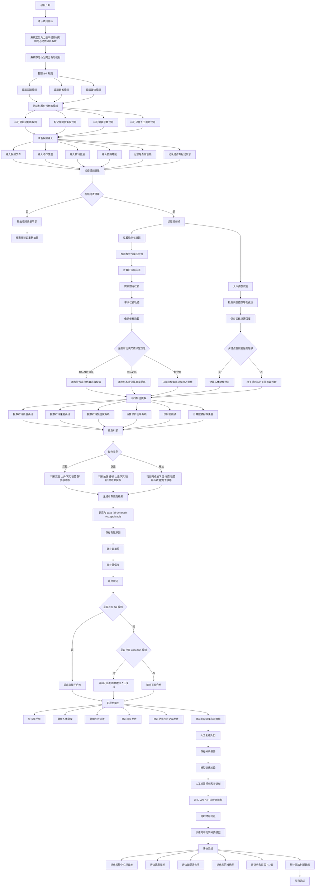

# 项目流程图

本文档基于项目中的 `基本指导.md`、`CODE RULES.md`、`AGENTS.md` 和 `rules/规则.md`。本文档也参考了 IPF 技术规则、MediaPipe、Ultralytics YOLO、OpenCV 和 PLOS ONE 的相关资料。

本项目的目标不是做完全自动裁判。本项目的目标是做力量举视频辅助判罚与动作分析系统。系统应该输出“可能合格”“可能不合格”“无法判断”或“视频质量不足”。系统还应该输出杠铃轨迹、速度曲线、估算杠铃功率曲线、失败原因和关键帧证据。

## 流程说明

系统先处理规则。系统需要把 IPF 的动作要求拆成机器能判断的规则。系统也需要标出哪些规则需要音频、多角度视频或人工复核。

系统再处理视频。系统需要读取视频文件、动作类型、杠铃重量、拍摄角度、音频情况和标定信息。系统需要先检查视频质量。如果视频质量不足，系统应该停止自动判定。

系统随后提取视觉信息。系统需要检测杠铃片或杠铃袖。系统需要跟踪杠铃中心点。系统也需要用人体姿态识别方法提取肩、髋、膝、踝等关键点。系统必须保存关键点置信度。系统在置信度不足时应该输出无法可靠判断。

系统接着提取动作特征。系统需要得到杠铃高度、速度、加速度和估算杠铃功率。系统也需要识别关键帧。关键帧包括开始帧、最低点帧、锁定帧和回架或下放帧。

系统最后用规则引擎输出结果。系统不应该只输出 `good_lift` 或 `no_lift`。系统应该输出可能合格、可能不合格、无法判断或视频质量不足。系统也应该给出失败原因、证据帧和置信度。

## 参考文献

International Powerlifting Federation. *IPF Technical Rule Book: Effective Date 01 March 2026, Version 3*. International Powerlifting Federation, 2026, https://www.powerlifting.sport/fileadmin/ipf/data/rules/technical-rules/english/2026_IPF_Technical_Rulebook__effective_01_March_2026__v3.pdf.

International Powerlifting Federation. "Technical Rules." *International Powerlifting Federation*, 2026, https://www.powerlifting.sport/rules/codes/info/technical-rules.

Google AI Edge. "Pose Landmark Detection Guide." *Google AI for Developers*, 21 Apr. 2026, https://ai.google.dev/edge/mediapipe/solutions/vision/pose_landmarker.

Ultralytics. "Multi-Object Tracking with Ultralytics YOLO." *Ultralytics Docs*, https://docs.ultralytics.com/modes/track/.

OpenCV. "Camera Calibration." *OpenCV Documentation*, https://docs.opencv.org/4.x/dc/dbb/tutorial_py_calibration.html.

OpenCV. "Optical Flow." *OpenCV Documentation*, https://docs.opencv.org/4.x/d4/dee/tutorial_optical_flow.html.

Renner, Alexander, Benedikt Mitter, and Arnold Baca. "Concurrent Validity of Novel Smartphone-Based Apps Monitoring Barbell Velocity in Powerlifting Exercises." *PLOS ONE*, vol. 19, no. 11, 2024, e0313919, https://doi.org/10.1371/journal.pone.0313919.
